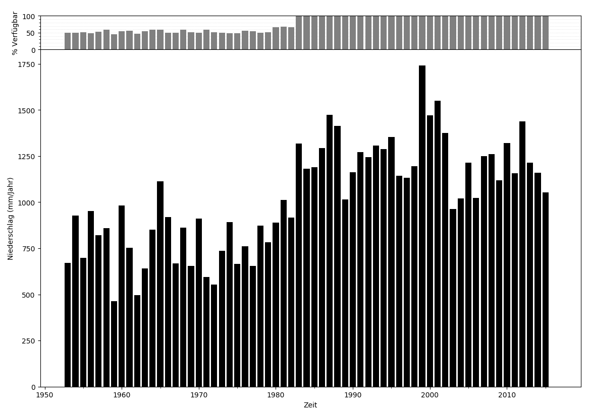

# eHYD Tools
Diverse tools to export and analyse the >10a rain time series from the [https://ehyd.gv.at](https://ehyd.gv.at) platform


If you are interested in a heavy rain analysis like on *Kostra*, take a look at my other python package 
[https://github.com/maxipi/intensity_duration_frequency_analysis](https://github.com/maxipi/intensity_duration_frequency_analysis) which is compatible with this package.

# Install

See the python packages requirements in the 'requirements.txt'. (those packages will get installed during the installing process)

To install the packages via github, [git](https://git-scm.com/) must be installed first.

Otherwise download the package manually via your browser and replace git+xxx.git with the path to the unzipped folder.

I recommend to use Anaconda to install python on Windows and the [Anaconda](https://www.anaconda.com/download/) Prompt for the commandline tool.

## Fresh install

The script is written in Python3.

```
pip install git+https://github.com/maxipi/ehyd_tools.git
```

To install the package only for the local user account, add ```--user``` to the install command.

## Update package

To update the package, add ```--upgrade``` to the install command.

```
pip install git+https://github.com/maxipi/ehyd_tools.git --upgrade
```

## Install without git

First download the package as a zip with the green download button above:

Then unzip the folder.

Now you can install the package with the local files

```
pip install <PATH_TO_FOLDER>\ehyd_tools-master
```

# Usage

To start the script use following commands in the terminal/Anaconda Prompt

Windows:
```python -m ehyd_tools```

Unix-Like:
```ehyd_tools```

## Commandline tool 

> ehyd_tools -h

```
usage: ehyd_tools [-h] [-id ID] [--input INPUT] [--add_gaps] [--to_csv]
                  [--max10a] [--start START] [--end END] [--plot]
                  [--statistics] [--meta] [--unix]

optional arguments:
  -h, --help     show this help message and exit
  -id ID         the id number for the station from the ehyd.gv.at platform
  --input INPUT  path to the rain input file including the filename
  --add_gaps     get the gaps in the series as a csv table
  --to_csv       save the data to the current directory
  --max10a       consider only 10 years with the most availability
  --start START  custom start time, Format="YYYY-MM-DD"
  --end END      custom end time, Format="YYYY-MM-DD"
  --plot         plot the data
  --statistics   creates a txt file with basic statistics (sum, max & min)
  --meta         add the txt file with the meta data of the ehyd data
  --unix         export the csv files with a "," as separator and a "." as
                 decimal sign.
```

## Example


### Example 1

```ehyd_tools -id 100180 --to_csv --max10a --add_gaps```

The results will be:

First the name of the station will be printed to the terminal.

```You choose the station: "Tschagguns" with the id: "100180".```

Because of the ```--max10a``` argument, the series will get a new start and end time base on the maximum availability.

```Data was clipped to start="1982-04-30" and end="1992-04-30".```

The standard filename of the output-files starts with *ehyd_\<ID\>*.

All the files will be created in the current directory.

With the ```--add_gaps``` argument, a csv file of the gaps in the series with the name *ehyd_\<ID\>_gaps.csv* will be created.

With the ```--to_csv``` argument, a csv file of the series with the name *ehyd_\<ID\>.csv* will be created.

After the command above two files will be created:

> ehyd_100180.csv
>
> ehyd_100180_gaps.csv

```
;start;end;gaps in days
8;1961-10-27 06:58:00;1962-05-16 07:00:00;201,001
20;1972-10-19 06:58:00;1973-05-02 07:00:00;195,001
5;1958-11-01 07:01:00;1959-05-15 07:00:00;194,999
2;1955-10-23 07:01:00;1956-05-01 07:00:00;190,999
22;1974-10-27 06:58:00;1975-05-05 07:00:00;190,001
0;1953-11-01 06:59:00;1954-05-06 07:01:00;186,001
13;1966-11-01 06:59:00;1967-05-04 07:00:00;184,001
27;1979-10-31 06:58:00;1980-05-01 07:00:00;183,001
23;1975-10-31 06:58:00;1976-05-01 07:00:00;183,001
12;1965-10-31 06:58:00;1966-05-01 07:00:00;182,001
21;1973-11-01 06:59:00;1974-05-01 07:01:00;181,001
29;1981-11-01 06:59:00;1982-05-01 07:01:00;181,001
26;1978-10-31 06:58:00;1979-04-25 07:01:00;176,002
15;1968-10-31 06:58:00;1969-04-24 07:00:00;175,001
3;1956-10-26 07:01:00;1957-04-19 07:00:00;174,999
7;1960-10-14 06:59:00;1961-04-04 07:00:00;172,001
9;1962-11-01 06:59:00;1963-04-19 07:00:00;169,001
25;1977-11-14 06:58:00;1978-05-01 07:02:00;168,003
10;1963-11-01 06:59:00;1964-04-15 07:00:00;166,001
19;1971-10-31 06:58:00;1972-04-13 07:00:00;165,001
24;1976-11-20 06:59:00;1977-05-01 07:00:00;162,001
1;1954-11-06 06:59:00;1955-04-16 07:00:00;161,001
6;1959-10-26 06:58:00;1960-04-01 07:00:00;158,001
4;1957-10-31 06:58:00;1958-04-01 07:00:00;152,001
14;1967-11-01 07:01:00;1968-04-01 07:00:00;151,999
18;1970-11-01 06:59:00;1971-04-01 07:00:00;151,001
11;1964-11-16 06:59:00;1965-04-01 07:00:00;136,001
17;1970-01-01 00:00:00;1970-04-30 07:00:00;119,292
16;1969-10-31 06:58:00;1970-01-01 00:00:00;61,710
28;1981-01-01 06:59:00;1981-03-01 07:01:00;59,001
```


### Example 2

```ehyd_tools -id 100180 --plot```

With the ```--plot``` argument, a png file of the series bar plot with the name *ehyd_\<ID\>_plot.png* will be created.

For data series longer than 15 years, annual sums, otherwise monthly sums, are used.

After the command above these file will be created:

> ehyd_100180_plot.png



### Example 3

```ehyd_tools -id 100180 --meta --statistics```

With the ```--meta``` argument, a txt file containing the meta data with the name *ehyd_\<ID\>_meta.txt* will be created.

With the ```--statistics``` argument, a txt file containing the statistics of the series with the name *ehyd_\<ID\>_stats.txt* will be created.

After the command above these two files will be created:


> ehyd_100180_meta.txt

```
Messstelle:                ;Tschagguns
HZB-Nummer:                ;100180
HD-Nummer:                 ;HD8000018
DBMS-Nummer:               ;8000018
Sachgebiet:                ;NLV
Dienststelle:              ;HD-Vorarlberg
Messstellenbetreiber:      ;Hydrographischer Dienst
Höhe:
 gültig seit:              ;Höhe [m ü.A.]:
  01.08.1921               ;681
Geographische Koordinaten (Referenzellipsoid: Bessel 1841):
 gültig seit:              ;Länge (Grad,Min,Sek):    ;Breite  (Grad,Min,Sek):
  01.08.1921               ;09 54 57                 ;47 04 03
Zugeordnete Messcodes:
 gültig seit: ;gültig bis:  ;Messcode:                           ;Entstehungsart:
  01.01.1953;   30.03.2004;  Nh/Schwimmer (Heber);                digitalisiert
  30.03.2004;              ; Nh/elekt.Waage, 500 cm², beh.;       Datensammler -> DFÜ
Ursprungszeitreihe:        ;Niederschlag,K,,,0,O,Z,0,,,
Transformation:            ;Summe
Summenintervall:           ;1 Minute
Exportzeitreihe:           ;Abgeleitete Intervallzeitreihe
                           ;Niederschlag,I,Sum,E,12,M,Z,0,,,
Exportqualität:            ;MAXQUAL (2)
Exportzeitraum:            ;Beginn der Datenaufzeichnung; bis ;01.01.2016 00:00
Hinweis:                   ;Der Intervallwert gilt bis zum nächsten Zeitpunkt mit einem Wert oder Lücke
Hinweis:                   ;ACHTUNG: Aufeinanderfolgende gleiche Werte von 0 und Lücke sind jeweils zu einem längeren Intervall zusammengefasst
Hinweis:                   ;Werte aus (teilweise) ungeprüften Rohdaten
Werteformat:               ;3 Nachkommastellen
Einheit:                   ;mm
```

> ehyd_100180_stats.txt

```
The annual totals of the data series serve as the data basis.
The following statistics were analyzed:

The maximum is 1438 mm and was in the year 2012.
The minimum is 0 mm and was in the year 2016.
The mean is 1090 mm.
```


## The stations

|id      |                      station|
|--------|-----------------------------|
|100180  |                   Tschagguns|
|100370  |                    Thüringen|
|100446  |                     Lustenau|
|100479  |                     Dornbirn|
|100776  |                      Bregenz|
|101303  |         Leutasch-Kirchplatzl|
|101816  |                 Ladis-Neuegg|
|102772  |                     Kelchsau|
|103143  |  St. Johann in Tirol-Almdorf|
|103895  |                    Eugendorf|
|104604  |                      Schlägl|
|104877  |                  Linz-Urfahr|
|105445  |                  Vöcklabruck|
|105528  |                         Wels|
|105908  |                      Flachau|
|106112  |                       Liezen|
|106252  |                    Wildalpen|
|106435  |       Klaus an der Pyhrnbahn|
|106559  |                        Steyr|
|106856  |      Weitersfelden-Ritzenedt|
|107029  |                  Lunz am See|
|107284  |                         Melk|
|107854  |                   Hollabrunn|
|108118  |    Wien (Botanischer Garten)|
|108456  |                   Gutenstein|
|108563  |                      Naglern|
|109280  |       Waidhofen an der Thaya|
|109918  |                  Neunkirchen|
|110064  |                   Gattendorf|
|110312  |                         Karl|
|110734  |                   Eisenstadt|
|111112  |                     Oberwart|
|111435  |                         Alpl|
|111716  |                    Judenburg|
|112086  |                 Graz-Andritz|
|112391  |       St.Peter am Ottersbach|
|112995  |             Ried im Innkreis|
|113001  |                      Sillian|
|113050  |           Matrei in Osttirol|
|113548  |                       Afritz|
|113670  |                      Waidegg|
|114561  |                   Klagenfurt|
|114702  |                    Wolfsberg|
|115055  |                   Kendlbruck|
|115642  |                    St.Pölten|
|120022  |                Hall in Tirol|