© [Institute of Urban Water Management and Landscape Water Engineering](https://www.tugraz.at), 
[Graz University of Technology](https://www.tugraz.at/home/) and [Markus Pichler](mailto:markus.pichler@tugraz.at)

# eHYD Tools

[](https://github.com/MarkusPic/ehyd_tools/blob/master/LICENSE)
[](https://pypi.python.org/pypi/ehyd-tools)
[](https://www.buymeacoffee.com/MarkusP)

Reading and analyzing hydro(geo)logic time series from the Austrian government's "ehyd.gv.at" platform.

Various tools for exporting and analyzing >10a rain time-series from the [ehyd.gv.at](https://ehyd.gv.at) platform of the Austian government.

If you are interested in a statistical heavy rain analysis like on *(Ö)Kostra*, take a look at my other python package [intensity_duration_frequency_analysis](https://github.com/MarkusPic/intensity_duration_frequency_analysis) which is compatible with this package.

# Install

The script is written in Python3. (use a version > 3.5)

## Windows

You have to install python (i.e. the original python from the [website](https://www.python.org/downloads/)).

The following commands show the usage for Linux/Unix systems. 

To use these features on Windows you have to add ```python -m``` before each command 
and you have to add the path to your python binary to the environment variables [^path1].

[^path1]: https://geek-university.com/python/add-python-to-the-windows-path/

There is also an option during the installation to add python to the PATH automatically. [^path2]

[^path2]: https://datatofish.com/add-python-to-windows-path/


## Linux/Unix

Python is pre-installed on most operating systems (as you probably knew).

## Required python packages

Packages required for this program will be installed with pip during the installation process and can be seen in the [`requirements.txt`](requirements.txt) file.

```mermaid
flowchart TD
    classDef missing stroke-dasharray: 5
    argh["argh<br>0.31.3"]
    certifi["certifi<br>2023.7.22"]
    charset-normalizer["charset-normalizer<br>3.3.0"]
    contourpy["contourpy<br>1.3.0"]
    cycler["cycler<br>0.12.1"]
    fonttools["fonttools<br>4.43.1"]
    idna["idna<br>3.4"]
    kiwisolver["kiwisolver<br>1.4.5"]
    matplotlib["matplotlib<br>3.8.0"]
    numpy["numpy<br>1.26.1"]
    packaging["packaging<br>24.1"]
    pandas["pandas<br>2.2.3"]
    pillow["Pillow<br>10.1.0"]
    pyparsing["pyparsing<br>3.1.1"]
    python-dateutil["python-dateutil<br>2.8.2"]
    pytz["pytz<br>2023.3.post1"]
    requests["requests<br>2.31.0"]
    six["six<br>1.16.0"]
    tzdata["tzdata<br>2023.3"]
    urllib3["urllib3<br>2.0.6"]
    contourpy -- "&ge;1.23" --> numpy
    matplotlib -- "&ge;0.10" --> cycler
    matplotlib -- "&ge;1.0.1" --> contourpy
    matplotlib -- "&ge;1.0.1" --> kiwisolver
    matplotlib -- "&ge;1.21,&lt;2" --> numpy
    matplotlib -- "&ge;2.3.1" --> pyparsing
    matplotlib -- "&ge;2.7" --> python-dateutil
    matplotlib -- "&ge;20.0" --> packaging
    matplotlib -- "&ge;4.22.0" --> fonttools
    matplotlib -- "&ge;6.2.0" --> pillow
    pandas -- "&ge;1.26.0" --> numpy
    pandas -- "&ge;2.8.2" --> python-dateutil
    pandas -- "&ge;2020.1" --> pytz
    pandas -- "&ge;2022.7" --> tzdata
    python-dateutil -- "&ge;1.5" --> six
    requests -- "&ge;1.21.1,&lt;3" --> urllib3
    requests -- "&ge;2,&lt;4" --> charset-normalizer
    requests -- "&ge;2.5,&lt;4" --> idna
    requests -- "&ge;2017.4.17" --> certifi

```



## Fresh install

```bash
pip install ehyd-tools
```

Add the following tags to the command for special options:

- ```--user```: To install the package only for the local user account (no admin rights needed)
- ```--upgrade```: To update the package

# Alternative Repositories

- https://github.com/hydrogeology-graz/ehyd
- https://github.com/joha1/ehyd_reader

# Usage for general time-series data

### Examples Jupyter notebooks for Extended python API

> links only work on GitHub!

- [the design rainfall](example/example_design_rainfall.ipynb)
- [model rain creator](example/example_synthetic_rain.ipynb)
- [the general data-reader](example/example_python_api_general.ipynb)
- [the gis extract](example/example_gis_export.ipynb)

# Usage for high-res precipitation time-series

To start the script use following commands in the terminal/Prompt

```ehyd_tools```

## Commandline tool 

With the `-h` (help) flag you can see the complete functionality of the tool.

```bash
ehyd_tools -h
```

> ```
> usage: __main__.py [-h] [-id ID] [--input INPUT] [--max10a] [--start START]
>                    [--end END] [--add_gaps] [--to_csv] [--to_parquet] [--plot]
>                    [--statistics] [--meta] [--unix]
> 
> optional arguments:
>   -h, --help     show this help message and exit
>   -id ID         the id number for the station from the ehyd.gv.at platform
>   --input INPUT  path to the rain input file including the filename
>   --max10a       consider only 10 years with the most availability (for
>                  clipping the data)
>   --start START  custom start time (Format="YYYY-MM-DD") for clipping the data
>   --end END      custom end time (Format="YYYY-MM-DD") for clipping the data
>   --add_gaps     save a gaps-table as a csv-file
>   --to_csv       save the time-series as csv-file (to the current directory if
>                  the id is used or in the directory of the input-file)
>   --to_parquet   save the time-series as parquet-file (to the current
>                  directory if the id is used or in the directory of the input-
>                  file) - parquet is a much faster as csv to read and write
>   --plot         save a bar-plot with monthly sums and availability as a png-
>                  file
>   --statistics   save the basic statistics (sum, max & min) as a txt-file
>   --meta         save the meta-data presented in ehyd as a txt-file
>   --unix         export the csv files with a "," as separator and a "." as
>                  decimal sign (otherwise ";" as separator and a "," as decimal
>                  sign will be used)
> ```

## The high-res precipitation stations

> links only work on GitHub!

[List of ehyd-stations with the id-number and the label](ehyd_tools/ehyd_stations.json)

## Examples

> links only work on GitHub!

[Example Jupyter notebook for the commandline](example/example_commandline.ipynb)

[Example Jupyter notebook for the python api](example/example_python_api.ipynb)

[Example python skript](example/example_python_api.py)

### Example results files

> links only work on GitHub!

[Data-gaps in the series](example/ehyd_112086_gaps.csv)

[Meta-data of the series](example/ehyd_112086_meta.txt)


### Example Plot

> links only work on GitHub!


